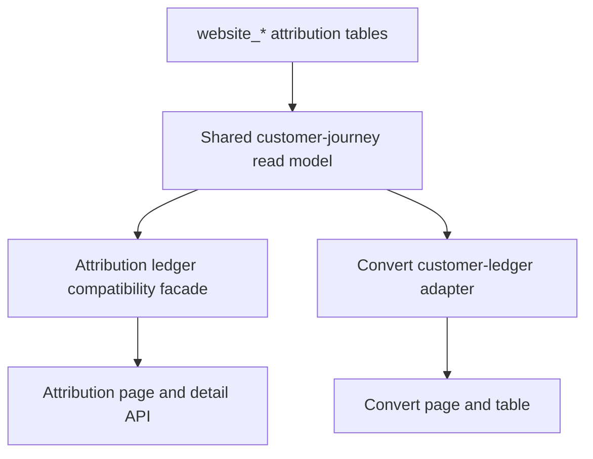

# Refactor Convert Customer Ledger to Shared Journey Read Model

## Summary

Convert's customer ledger will stop querying `website_conversions` directly and instead consume a shared customer-journey read model built from the existing attribution ledger logic. The first implementation focuses on the read-model foundation: one journey row per visitor plus latest conversion context, compatibility for the current attribution ledger, and Convert-specific mapping that handles non-converting journeys without inflating CAPI gap metrics.

---

## Problem Frame

Convert is meant to become the unified customer conversion room, but its current ledger only sees conversion rows. The attribution ledger already assembles the richer visitor, session, event, paid-touch, conversion, and CAPI context needed for the future unified surface, so the immediate gap is duplicated read logic and incompatible row grain.

---

## Requirements

- R1. Provide a canonical customer-journey read model that merges `website_visitors`, `website_sessions`, `website_events`, and `website_conversions` using the existing attribution-paid-touch selection behavior.
- R2. Make Convert's customer ledger consume the shared model instead of running its own `website_conversions` query.
- R3. Keep the row grain as one customer journey keyed by visitor plus latest conversion context, with explicit `hasConversion` and `hasPaidTouch` semantics.
- R4. Preserve the existing attribution ledger page, detail API, route permission behavior, and current tests while the old page still exists.
- R5. Preserve Ads Analyst data-boundary rules: use the limited `web` client path for analyst-owned reads and do not introduce Sales/ERP reads, writes, migrations, or Shopify calls in this plan.
- R6. Keep Convert's status sentence, metrics, empty state, and CAPI gap count correct when shared rows include visitors without conversions.
- R7. Add focused unit coverage for the shared row builder and Convert adapter so later timeline, thumbnail, and Sales/ERP snapshot work can build on stable contracts.

---

## Scope Boundaries

- No timeline drawer migration into Convert in this plan.
- No ad creative thumbnail or Meta creative enrichment in this plan.
- No Sales/ERP budget, invoice, paid, balance, or sales-stage integration in this plan.
- No `/attribution-ledger` nav removal, redirect, deep-link migration, or route retirement in this plan.
- No database schema changes, Supabase migrations, data backfills, or live Shopify/Admin API calls.
- No broad Convert redesign beyond the table copy and fields required for the new row grain.

### Deferred to Follow-Up Work

- Convert journey drawer: move the attribution detail timeline into Convert after the shared row contract is stable.
- Creative preview enrichment: batch enrich shared rows from ad IDs and cached Meta creative assets.
- Sales/ERP snapshot: add a narrow read-only finance/status view after identity confidence rules are defined.
- Attribution page consolidation: hide, redirect, and retire `/attribution-ledger` only after Convert reaches parity.

---

## Context & Research

### Relevant Code and Patterns

- `src/app/(workspace)/convert/page.tsx` currently fetches funnel, inbox, and a local `fetchLedger()` in parallel. The local ledger query reads only `website_conversions` and maps directly to `CustomerLedgerRow`.
- `src/components/v2/convert/customer-ledger.tsx` is currently a conversion-oriented table. Its comment, type, empty state, booking column, and CAPI chip all assume each row is one conversion.
- `src/lib/attribution-ledger.ts` already fetches visitor, session, event, and conversion tables through `createAdsAnalystClient("web")`, then builds visitor-level rows with paid-touch and CAPI context.
- `tests/attribution-ledger.test.ts` already covers latest conversion selection, non-converting visitors, richer paid-touch selection over link-in-bio fallbacks, nested attribution JSON, URL-derived ad IDs, and curated detail timelines.
- `src/app/attribution-ledger/page.tsx`, `src/app/api/attribution-ledger/detail/route.ts`, and `src/components/attribution-ledger-client.tsx` depend on the current attribution ledger exports and should remain compatible.
- `tests/app-routes.test.ts` verifies `/attribution-ledger` is gated by `view_dashboard`, not `view_inbox`.

### Institutional Learnings

- `docs/data-boundaries.md` establishes Sales/ERP Core as the source of truth for customer, appointment, payment, and document data. This plan stays within Ads Analyst-owned website attribution tables.
- `docs/ui-rebuild-prd.md` says `/website-funnel` and `/attribution-ledger` are intended to merge into Convert, but API routes can remain at existing paths while UI consolidation is phased.
- No `docs/solutions/` files were present in this worktree during planning.

### External References

- None. Local code contains the relevant data-access, attribution, route-permission, and test patterns, so external research would add little practical value for this bounded refactor.

---

## Key Technical Decisions

- Create a shared domain module rather than making Convert import attribution-page-specific naming directly. The shared module becomes the canonical source for journey rows, while `src/lib/attribution-ledger.ts` remains a compatibility facade for existing page and API imports.
- Keep Convert-specific display mapping in a small adapter instead of binding the table directly to every shared row field. This lets the shared model stay attribution-domain accurate while Convert owns labels, empty states, metric semantics, and future row presentation.
- Count CAPI gaps only for rows with a conversion. Shared rows may include visitors without bookings, and treating every non-converter as a missing CAPI event would make the Convert status sentence misleading.
- Preserve the existing permission boundary. Convert and Attribution continue to require `view_dashboard`; the shared read model continues to use `createAdsAnalystClient("web")`.
- Keep attribution detail behavior exported through the existing attribution module. The detail drawer is future Convert work; this plan only prepares the shared row model that a future drawer can use.
- Use the shared model's date-range normalization for Convert. Convert should pass `days` when no explicit range is present and pass `start`/`end` when the URL supplies them, matching the attribution ledger pattern.

---

## Open Questions

### Resolved During Planning

- Should thumbnail, drawer, and Sales/ERP finance work be included now? No. They are real follow-ups from the ideation artifact, but this plan intentionally stabilizes the shared journey row contract first.
- Should `/attribution-ledger` be retired as part of this refactor? No. Existing routes and deep links stay alive until Convert reaches feature parity.
- Should Convert show journey rows that do not have conversions? Yes, because the shared model's row grain is journey-based. The UI and metrics must label and count those rows carefully rather than pretending they are booked customers.

### Deferred to Implementation

- Final table column labels for mixed conversion and non-conversion rows: the implementation should keep labels truthful and compact, but exact UI copy can be settled while wiring the component.
- Final row limit and sort tuning for Convert: start from the shared model's existing visitor limit and newest-first behavior, then adjust only if local rendering or product review shows the table is too noisy.
- Exact module export shape: the implementation may choose aliases or wrapper functions as long as the shared module is canonical and existing attribution imports remain compatible.

---

## High-Level Technical Design

> *This illustrates the intended approach and is directional guidance for review, not implementation specification. The implementing agent should treat it as context, not code to reproduce.*

The shared model owns the database reads, date-range normalization, row merge, paid-touch selection, and summary counts. Attribution keeps its existing public names through a facade. Convert receives a smaller view model derived from shared rows and owns the table-specific semantics.

---

## Implementation Units

### U1. Add Characterization Coverage for Shared Journey Semantics

**Goal:** Lock down the attribution row behavior that Convert will begin relying on before extraction changes module boundaries.

**Requirements:** R1, R3, R4, R7

**Dependencies:** None

**Files:**
- Modify: `tests/attribution-ledger.test.ts`
- Test: `tests/attribution-ledger.test.ts`

**Approach:**
- Treat the existing attribution tests as characterization for the shared read model.
- Add coverage around `buildAttributionLedgerData()` summary output, not only `buildAttributionLedgerRows()`, so summary semantics survive the extraction.
- Keep test data small and focused on visitor, session, event, conversion, paid-touch, and CAPI combinations that drive the shared contract.

**Execution note:** Add characterization coverage before moving code so failures distinguish behavior drift from import churn.

**Patterns to follow:**
- Existing helper rows in `tests/attribution-ledger.test.ts`.

**Test scenarios:**
- Happy path: visitor with latest conversion and paid touch produces one row with conversion customer fields, booking time, paid identifiers, and `hasConversion: true`.
- Edge case: visitor without a conversion remains present, uses latest session context, and reports `hasConversion: false`.
- Edge case: summary counts visitors shown, visitors with conversions, visitors with paid touch, and CAPI statuses without counting null CAPI statuses.
- Edge case: richer pre-booking paid attribution wins over a later organic or link-in-bio touch.

**Verification:**
- Attribution ledger tests document the row and summary behaviors Convert is allowed to depend on.

### U2. Extract the Shared Customer-Journey Read Model

**Goal:** Introduce the canonical shared module for journey data while preserving existing attribution ledger imports.

**Requirements:** R1, R3, R4, R5, R7

**Dependencies:** U1

**Files:**
- Create: `src/lib/customer-journey-ledger.ts`
- Modify: `src/lib/attribution-ledger.ts`
- Modify: `tests/attribution-ledger.test.ts`
- Test: `tests/attribution-ledger.test.ts`

**Approach:**
- Move the visitor/session/event/conversion row types, fetch flow, date-range normalization, row builder, summary builder, and paid-touch normalization helpers into `src/lib/customer-journey-ledger.ts`.
- Rename canonical domain exports to customer-journey language, while keeping attribution-named exports as aliases or wrappers in `src/lib/attribution-ledger.ts`.
- Leave the attribution detail API contract available from `src/lib/attribution-ledger.ts`; move only the shared helpers it needs when that reduces duplication.
- Preserve the current database client role and table set. The extraction should not add Sales/ERP tables, service-role-only assumptions, or new migrations.

**Patterns to follow:**
- Existing `fetchAttributionLedgerData()` limited-client comment and parallel related-row fetch pattern.
- Existing `selectBestPaidTouch()` usage from `src/lib/attribution-touch-selection.ts`.

**Test scenarios:**
- Happy path: attribution-named imports still return the same row data through the compatibility facade.
- Edge case: normalized date range behaves the same for `days`, explicit `start`/`end`, and default inputs.
- Edge case: paid-touch selection from conversion, event, nested JSON, and visitor fallback remains unchanged after extraction.
- Error path: database read errors still propagate to the caller rather than returning partial shared data as if successful.

**Verification:**
- Existing attribution page consumers can keep importing from `src/lib/attribution-ledger.ts`.
- Shared model names are available for Convert without carrying attribution-page naming into new code.

### U3. Add a Convert-Specific Journey Adapter

**Goal:** Translate shared journey rows into the compact table and metrics shape Convert needs.

**Requirements:** R2, R3, R6, R7

**Dependencies:** U2

**Files:**
- Create: `src/lib/convert-customer-ledger.ts`
- Modify: `src/components/v2/convert/customer-ledger.tsx`
- Create: `tests/convert-customer-ledger.test.ts`
- Test: `tests/convert-customer-ledger.test.ts`

**Approach:**
- Define a Convert view model derived from shared rows rather than reusing the entire shared row type in the client component.
- Carry enough fields for the current table and near-term drawer handoff: stable row ID, visitor ID, optional conversion event ID, display timestamp, customer fields, appointment fields, source fields, paid identifiers, CAPI status, and conversion flags.
- Move CAPI gap counting into the adapter/helper layer so it can be tested independently from the Next page.
- Keep the adapter pure and client-safe. If page-level date parsing or fallback behavior needs test coverage, expose that logic as pure helpers rather than importing server-only fetch code into the client table.
- Update the table type/comment to reflect journey rows, not raw `website_conversions` rows.

**Patterns to follow:**
- Current `CustomerLedgerRow` table shape in `src/components/v2/convert/customer-ledger.tsx`.
- Existing chip and date-format helpers in the same component.

**Test scenarios:**
- Happy path: conversion journey maps booking time, customer fields, paid source/campaign, appointment type, CAPI status, and `hasConversion: true`.
- Edge case: non-converting journey maps last-seen time for display, keeps customer/session context when present, and does not count as a CAPI gap.
- Edge case: conversion with missing, failed, or error CAPI status counts as a CAPI gap; sent/success/queued/pending statuses do not count as failures.
- Edge case: missing customer name/email renders through the adapter without manufacturing identity certainty.

**Verification:**
- Convert table and status helpers can be tested without rendering the full Next page.
- Non-conversion journeys are represented explicitly and do not break current table rendering.

### U4. Wire Convert to the Shared Model

**Goal:** Remove Convert's direct conversion-table query and source its customer ledger from the shared journey model.

**Requirements:** R2, R3, R5, R6

**Dependencies:** U2, U3

**Files:**
- Modify: `src/app/(workspace)/convert/page.tsx`
- Modify: `src/components/v2/convert/customer-ledger.tsx`
- Test: `tests/convert-customer-ledger.test.ts`

**Approach:**
- Replace the local `fetchLedger()` implementation with a call to the shared customer-journey fetcher, then map rows through the Convert adapter.
- Preserve Convert's existing `view_dashboard` permission gate and fallback behavior when ledger data fails to load.
- Pass explicit `start` and `end` query params to the shared model when provided; otherwise use the existing `days` fallback.
- Update the status sentence and metric inputs to use tested adapter helpers so CAPI gaps and empty states remain truthful for mixed journey rows.
- Keep the server page responsible for calling the shared fetcher; keep reusable parsing, mapping, and metric helpers in `src/lib/convert-customer-ledger.ts` so they can be tested without importing a Next page module.
- Update table labels or empty copy only as needed to avoid saying "conversion" when the row set now represents journeys.

**Patterns to follow:**
- Existing parallel data loading and catch-to-empty fallback in `src/app/(workspace)/convert/page.tsx`.
- Existing attribution date-range behavior in `src/app/attribution-ledger/page.tsx`.

**Test scenarios:**
- Integration: page-level ledger fallback still returns an empty table view model if the shared fetcher throws.
- Happy path: Convert search params with explicit `start` and `end` map to a shared ledger request that uses those dates rather than ignoring them.
- Edge case: an empty shared row set produces the no-activity sentence only when funnel and inbox are also empty.
- Edge case: non-conversion shared rows increase ledger row count but do not increase booking count or CAPI gap count.

**Verification:**
- `src/app/(workspace)/convert/page.tsx` no longer imports `createAdsAnalystClient` or queries `website_conversions` directly.
- Convert renders from shared journey rows while preserving the existing funnel and inbox data flow.

### U5. Preserve Attribution Compatibility and Route Boundaries

**Goal:** Confirm the extraction did not accidentally change attribution page behavior, permissions, or route-level contracts.

**Requirements:** R4, R5, R7

**Dependencies:** U2, U4

**Files:**
- Modify if required by extraction: `src/app/attribution-ledger/page.tsx`
- Modify if required by extraction: `src/app/api/attribution-ledger/detail/route.ts`
- Modify if required by extraction: `src/components/attribution-ledger-client.tsx`
- Test: `tests/app-routes.test.ts`
- Test: `tests/attribution-ledger.test.ts`

**Approach:**
- Keep existing attribution imports unchanged when the facade can preserve them; only update imports if required by the extraction.
- Keep `/api/attribution-ledger/detail` on the existing detail data shape and permission checks.
- Confirm route permission tests still prove `/attribution-ledger` belongs to `view_dashboard`.
- Clean up stale comments that describe Convert rows as conversion rows or attribution code as page-local only.

**Patterns to follow:**
- Existing route permission tests in `tests/app-routes.test.ts`.
- Existing attribution detail fetch and drawer code in `src/components/attribution-ledger-client.tsx`.

**Test scenarios:**
- Integration: `/attribution-ledger` remains accessible to `view_dashboard` and not to inbox-only users.
- Integration: attribution detail data still includes credited touch, return touch, summary, timeline, confidence, and CAPI fields.
- Regression: current attribution ledger client type imports still compile against the compatibility facade.

**Verification:**
- Existing attribution page and detail API behavior remain unchanged from a user perspective.
- The old page is still available for debugging until a later Convert parity plan retires it.

---

## System-Wide Impact

- **Interaction graph:** Convert, Attribution, and the detail API will share the same journey-read foundation. The shared module becomes a common dependency for two server-rendered surfaces and one API route through the attribution facade.
- **Error propagation:** Database errors should continue to throw from the shared model. Convert catches ledger fetch failures and falls back to an empty ledger; Attribution should preserve its existing page/API error behavior.
- **State lifecycle risks:** This is read-only and should not create partial-write, cache invalidation, duplicate-write, or cleanup concerns.
- **API surface parity:** Attribution exports must remain stable while Convert moves to shared names. Any new shared exports should not force client components to import server-only database code except as type-only imports.
- **Integration coverage:** Unit tests prove row and adapter behavior; route tests prove permission mapping. Manual UI smoke is still useful after implementation because the table will contain journey rows with more varied null states than conversion rows.
- **Unchanged invariants:** `view_dashboard` remains the gate for Convert and Attribution; `view_inbox` alone does not grant attribution access; Sales/ERP remains outside this plan.

---

## Risks & Dependencies

| Risk | Mitigation |
|------|------------|
| Convert appears noisier because shared rows can include visitors without bookings. | Keep `hasConversion` explicit, adjust labels/empty state, and count bookings/CAPI gaps only from conversion rows. Defer richer filtering to the timeline/table UX follow-up. |
| Extraction breaks existing attribution page imports. | Keep `src/lib/attribution-ledger.ts` as a facade and run existing attribution tests after the move. |
| Shared module name overstates identity certainty. | Use "journey" language in shared names and preserve confidence semantics for detail data. Avoid implying browser visitor ID equals legal customer identity. |
| CAPI gap metric becomes misleading with non-converters. | Test CAPI gap helper separately and count only rows with conversions. |
| Data-boundary drift toward Sales/ERP or Shopify happens too early. | Keep this plan read-only against existing Ads Analyst website tables and defer finance/Shopify integration to later plans. |
| Next app-router behavior changes during implementation. | Follow repo instructions to consult the local Next documentation before editing Next route/page code. |

---

## Documentation / Operational Notes

- Update stale code comments in Convert so future implementers do not think the table is still one row per `website_conversion`.
- No public docs, migrations, rollout flags, or operational dashboards are required for this refactor.
- Later plans should reference this shared model before adding thumbnails, timelines, or Sales/ERP finance snapshots.

---

## Sources & References

- Origin document: `docs/ideation/2026-05-21-customer-ledger-attribution-ledger-ideation.md`
- Related code: `src/lib/attribution-ledger.ts`
- Related code: `src/app/(workspace)/convert/page.tsx`
- Related code: `src/components/v2/convert/customer-ledger.tsx`
- Related code: `src/app/attribution-ledger/page.tsx`
- Related code: `src/app/api/attribution-ledger/detail/route.ts`
- Related tests: `tests/attribution-ledger.test.ts`
- Related tests: `tests/app-routes.test.ts`
- Boundary context: `docs/data-boundaries.md`
- UI consolidation context: `docs/ui-rebuild-prd.md`
