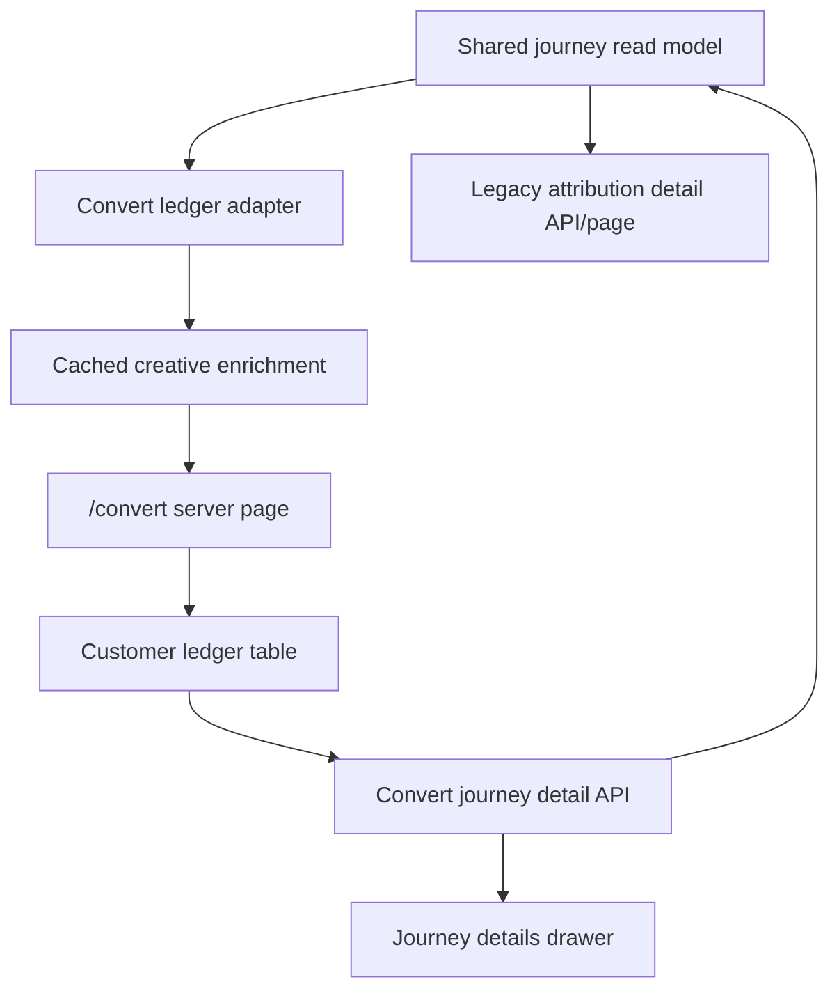
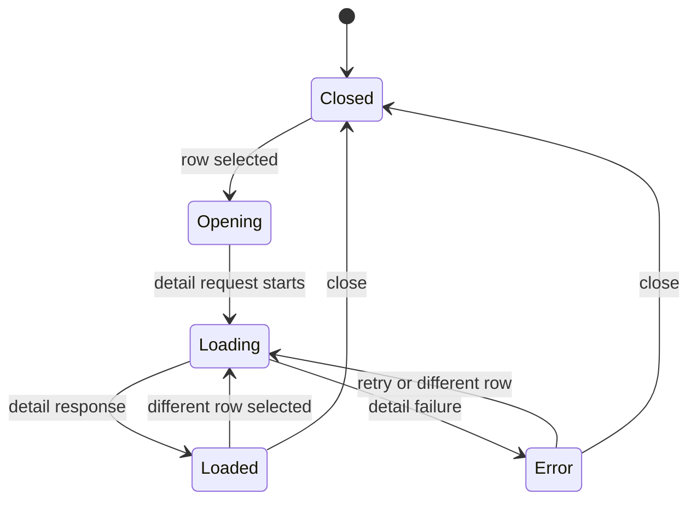

# Add Convert Journey Drawer and Creative Thumbnails

## Summary

Convert's customer ledger should become the visible customer-journey surface, not just a thin table backed by the shared read model. This plan adds cached ad creative previews to ledger rows and moves the attribution detail experience into Convert as a row details drawer with a curated journey timeline.

---

## Problem Frame

The shared customer-journey read model is now in place, but `/convert` still presents a compact table with no creative preview and no way to inspect the customer's path. Operators still need `/attribution-ledger` for the timeline and still cannot see the ad creative directly beside the customer journey, so Convert is not yet a replacement surface.

---

## Requirements

- R1. Show a thumbnail preview and concise ad/creative context in Convert's customer ledger rows when a credited paid touch has an ad ID.
- R2. Keep creative enrichment read-only and cache-backed, using existing Ads Analyst Meta catalog tables rather than live Meta API calls during page render.
- R3. Add a Convert-owned journey detail drawer that opens from a ledger row and shows summary, confidence, credited paid touch, return touch, booking/CAPI details, and a curated timeline.
- R4. Reuse the shared customer-journey detail model so Convert and the legacy attribution page do not fork timeline logic.
- R5. Preserve Convert's existing permission boundary (`view_dashboard`) and avoid Sales/ERP, Shopify, writes, migrations, or data-boundary changes in this step.
- R6. Keep deep-linkable drawer state so a specific visitor or booking journey can be reopened from a Convert URL.
- R7. Preserve the existing attribution ledger page and detail API until Convert reaches parity and a later plan retires or redirects it.
- R8. Add focused tests for creative enrichment, Convert row mapping, detail request identity, and timeline/noise semantics.

---

## Scope Boundaries

- No Sales/ERP budget, invoice, payment, balance, owner, or sales-stage fields in this plan.
- No Shopify Admin API calls, webhooks, reconciliation jobs, or finance snapshots.
- No database schema changes, Supabase migrations, or backfills.
- No live Meta API calls from `/convert`; creative previews must come from stored `meta_ads` and `meta_creatives` data.
- No removal, redirect, or nav hiding for `/attribution-ledger`.
- No broad Convert redesign beyond the customer ledger table and detail drawer.
- No raw all-events debug stream by default; the drawer should prioritize the curated timeline already produced by the shared detail model.

### Deferred to Follow-Up Work

- Sales/ERP snapshot: budget, invoice, amount paid, balance due, and sales stage after identity confidence rules are defined.
- Attribution page consolidation: hide, redirect, and eventually retire `/attribution-ledger` after Convert has parity and deep links are migrated.
- Outcome feedback loop: connect paid amount or sales outcome back to ad/creative reporting after the finance snapshot exists.

---

## Context & Research

### Relevant Code and Patterns

- `src/lib/customer-journey-ledger.ts` now owns shared row and detail assembly. It already exposes row-level `adId`, `adsetId`, `campaignId`, `placement`, paid source fields, conversion context, and `fetchCustomerJourneyLedgerDetail()`.
- `src/lib/convert-customer-ledger.ts` maps shared journey rows into the current Convert table shape. It currently drops `adId`, `adsetId`, `placement`, phone, device, first page, and creative preview fields.
- `src/app/(workspace)/convert/page.tsx` fetches funnel, inbox, and ledger data in parallel, then renders `<CustomerLedger rows={ledger} />`.
- `src/components/v2/convert/customer-ledger.tsx` is still a static table. It does not track selected rows, fetch details, sync URL state, or render a drawer.
- `src/components/attribution-ledger-client.tsx` contains the current drawer pattern: row selection, detail fetch, loading/error states, deep-link query params, summary, touch cards, timeline, confidence, and copy-link behavior.
- `src/app/api/attribution-ledger/detail/route.ts` already gates detail reads with `view_dashboard` and calls `fetchAttributionLedgerDetail()` through the attribution facade.
- `src/lib/period-pivot-data.ts` has a cached creative asset fetch pattern for `meta_creatives` and prefers Supabase-cached image URLs before volatile Meta CDN URLs.
- `src/lib/creative-analysis.ts` shows the `meta_ads.ad_id -> creative_id -> meta_creatives` enrichment pattern and ad fallback fields such as `preview_url`, `preview_html`, and `preview_source`.
- `src/components/v2/optimize/creative-grid.tsx`, `src/components/v2/optimize/tree-table.tsx`, and `src/components/v2/optimize/creative-grid-with-drawer.tsx` show compact thumbnail cells and preview fallback behavior already accepted in this UI.
- `tests/attribution-ledger.test.ts` already covers the sanitized timeline behavior: credited paid touch, return touch, booking submit, conversion, CAPI event, and exclusion of noisy post-booking page activity.
- `tests/convert-customer-ledger.test.ts` already covers Convert mapping, non-converter rows, CAPI gap counting, and status sentence behavior.

### Institutional Learnings

- `docs/data-boundaries.md` keeps customer, appointment, document, and payment truth in Sales/ERP Core. This plan stays inside Ads Analyst-owned website and Meta catalog tables.
- `docs/sync-architecture.md` says creative previews are refreshed metadata and should prefer cached `supabase_thumbnail_url` / `supabase_image_url`, then Meta image fields and preview fallbacks.
- `docs/ui-rebuild-prd.md` positions Convert as the eventual merged funnel + attribution surface, while API routes can remain during phased consolidation.
- The previous plan explicitly deferred thumbnails and the Convert detail drawer until after the shared journey row contract was stable.

### External References

- None. The codebase already has direct local patterns for the shared detail model, cached creative metadata, thumbnail rendering, route permission checks, and Convert table behavior.

---

## Key Technical Decisions

- Keep thumbnail enrichment Convert-specific for now. The shared journey model should stay focused on website attribution truth, while Convert owns presentation enrichment from Meta catalog tables.
- Use a new cached creative enrichment helper rather than importing `period-pivot-data.ts` internals. That fetcher is currently private and shaped around pivot entities; Convert needs ad-ID keyed enrichment.
- Resolve creative preview from stored data only: `adId -> meta_ads.creative_id -> meta_creatives`, preferring Supabase-cached URLs before volatile Meta CDN URLs.
- Add a Convert-owned detail API path while reusing `fetchCustomerJourneyLedgerDetail()` internally. This keeps route naming aligned with Convert and avoids coupling the new UI to `/api/attribution-ledger/detail`.
- Reuse the timeline semantics, not necessarily the attribution ledger component wholesale. The legacy drawer is wide, technical, and attribution-page styled; Convert should keep the same data contract but render it as an operational customer journey drawer.
- Preserve URL-addressable drawer state with `visitorId` and optional `acuityAppointmentId`. The table row remains the source for immediate context, and the detail API fills in the timeline.
- Keep tests concentrated in pure adapters/builders plus existing attribution detail tests. React component behavior should be verified through TypeScript and browser smoke unless a component test harness is introduced separately.

---

## Open Questions

### Resolved During Planning

- Should thumbnails be in this same follow-up? Yes. The user confirmed this plan should cover the complete visible ledger upgrade: table thumbnail preview plus timeline/details drawer.
- Should creative previews come from live Meta calls? No. Existing sync/caching architecture makes stored catalog metadata the appropriate source for page render.
- Should Sales/ERP/payment status be included? No. That remains a separate data-boundary and identity-confidence plan.
- Should the legacy attribution page be removed now? No. It remains available until Convert reaches parity and existing links can be migrated.

### Deferred to Implementation

- Final drawer copy and event labels: start from current timeline labels, but implementation may tune wording while preserving the same event categories and filtering semantics.
- Duplicate `ad_id` rows across Meta accounts: implementation should choose a deterministic stored row, preferably the newest synced row with a linked creative, unless the row model later gains `meta_account_id`.
- Exact component extraction boundary from `attribution-ledger-client.tsx`: the implementer may extract shared presentational pieces or build Convert-specific equivalents if that is cleaner.
- Whether the drawer includes a compact raw IDs section: include only if it helps debugging without making the default timeline noisy.

---

## High-Level Technical Design

> *This illustrates the intended approach and is directional guidance for review, not implementation specification. The implementing agent should treat it as context, not code to reproduce.*

The table should be useful before the drawer finishes loading: it already has customer, booking, source, CAPI, and creative preview context. Opening a row fetches the detail payload and renders the curated timeline, confidence, paid touch, return touch, booking, and CAPI detail.

---

## Implementation Units

### U1. Extend the Convert Ledger View Model for Creative and Drawer Context

**Goal:** Carry the paid identifiers and display fields Convert needs for thumbnails, drawer selection, and useful fallback labels.

**Requirements:** R1, R3, R6, R8

**Dependencies:** None

**Files:**
- Modify: `src/lib/convert-customer-ledger.ts`
- Modify: `tests/convert-customer-ledger.test.ts`
- Test: `tests/convert-customer-ledger.test.ts`

**Approach:**
- Add explicit fields to `CustomerLedgerRow` for `adId`, `adsetId`, `campaignId`, `placement`, `customerPhone`, `deviceBrowser`, `firstPage`, `sessionId`, and a nullable creative preview object.
- Keep the current stable `rowId` behavior (`conversionEventId || visitorId`) and include drawer request identity fields (`visitorId`, optional `acuityAppointmentId`).
- Keep the adapter pure: map shared journey rows to Convert rows without database access.
- Update CAPI gap behavior in the same test file only if implementation discovers a status/table mismatch while touching the adapter; otherwise keep that concern separate.

**Execution note:** Extend the adapter tests before updating UI components so the table and drawer consume a stable view model.

**Patterns to follow:**
- Existing `customerLedgerRowsFromJourneys()` mapping in `src/lib/convert-customer-ledger.ts`.
- Shared row fields in `src/lib/customer-journey-ledger.ts`.

**Test scenarios:**
- Happy path: a journey with paid touch identifiers maps `adId`, `adsetId`, `campaignId`, `placement`, source, customer, booking, and drawer identity fields.
- Edge case: a non-converting journey maps `visitorId`, `lastSeen`, `firstPage`, and nullable creative fields without requiring an appointment or conversion event.
- Edge case: a row with no paid touch keeps all creative/ad fields null and still renders as a valid customer journey row.
- Edge case: `rowId` remains stable when a conversion exists and when the row is visitor-only.

**Verification:**
- Convert row mapping exposes everything the thumbnail cell and drawer opener need without importing the shared server model into the client component.

### U2. Add Cached Creative Preview Enrichment for Ledger Rows

**Goal:** Attach stored ad/creative preview data to Convert ledger rows in a batched, read-only fetch.

**Requirements:** R1, R2, R5, R8

**Dependencies:** U1

**Files:**
- Create: `src/lib/customer-ledger-creative-enrichment.ts`
- Modify: `src/app/(workspace)/convert/page.tsx`
- Modify: `tests/convert-customer-ledger.test.ts`
- Create: `tests/customer-ledger-creative-enrichment.test.ts`
- Test: `tests/convert-customer-ledger.test.ts`
- Test: `tests/customer-ledger-creative-enrichment.test.ts`

**Approach:**
- Collect unique non-null `adId`s from Convert ledger rows after the shared journey mapping.
- Query `meta_ads` by `ad_id` through `createAdsAnalystClient("web")`, selecting ad name, creative ID, account, status, and preview fallback fields.
- Query `meta_creatives` for linked creative IDs, selecting name/title/body plus cached image and preview fields.
- Build a small `CustomerLedgerCreativePreview` object keyed by `adId` and attach it to rows.
- Prefer image sources in this order: Supabase-cached thumbnail for table cells, Supabase-cached image for drawer hero, then Meta thumbnail/image/video thumbnail, then preview URL/HTML when image fields are missing.
- On fetch failure, log a scoped warning and return rows without previews. Missing creative metadata should not fail the Convert page.
- Handle duplicate stored ad rows deterministically: prefer rows with a creative ID and the newest `last_synced_at`; keep the behavior tested so ambiguous catalog data does not produce random previews.

**Patterns to follow:**
- `fetchCreativeAssets()` in `src/lib/period-pivot-data.ts` for cached creative field selection and fallback priorities.
- `fetchCreativeMetadata()` / `enrichCreativeRow()` in `src/lib/creative-analysis.ts` for `meta_ads -> meta_creatives` joining.
- Existing limited-client usage in `src/lib/customer-journey-ledger.ts`.

**Test scenarios:**
- Happy path: a row with `adId` joins to `meta_ads.creative_id`, then `meta_creatives`, and receives creative name plus thumbnail/image fields.
- Edge case: a row with an ad row but no creative row receives ad-level fallback name/preview fields when available.
- Edge case: a row with no `adId` remains unchanged and does not trigger a metadata query.
- Edge case: duplicate ad rows choose the deterministic best row rather than whichever row appears first.
- Error path: a metadata query error produces original ledger rows with null creative previews instead of throwing through `/convert`.

**Verification:**
- Convert page still renders when creative metadata is incomplete or unavailable.
- Creative enrichment stays read-only and uses only Ads Analyst tables.

### U3. Add a Convert Journey Detail API

**Goal:** Provide a Convert-named endpoint for the drawer while reusing the shared journey detail model.

**Requirements:** R3, R4, R5, R6, R7, R8

**Dependencies:** U1

**Files:**
- Create: `src/app/api/convert/customer-ledger/detail/route.ts`
- Modify: `src/lib/convert-customer-ledger.ts`
- Test: `tests/attribution-ledger.test.ts`
- Test: `tests/convert-customer-ledger.test.ts`
- Test: `tests/app-routes.test.ts`

**Approach:**
- Accept `visitorId` and optional `acuityAppointmentId` query params, mirroring the attribution detail route's identity contract.
- Gate the route with `view_dashboard`, matching `/convert` and `/attribution-ledger`.
- Call `fetchCustomerJourneyLedgerDetail()` or the attribution facade equivalent, but return a Convert-owned response type if the UI needs renamed fields.
- Add small request/identity helpers in `src/lib/convert-customer-ledger.ts` so required-param handling and detail URL construction are testable without a full Next route harness.
- Keep the legacy `/api/attribution-ledger/detail` route unchanged.
- Return 400 for missing `visitorId`, 404 when no detail is found, and use the existing JSON error helper for permission/runtime errors.
- Avoid adding sales or finance identity matching in this route.

**Patterns to follow:**
- `src/app/api/attribution-ledger/detail/route.ts`.
- `fetchCustomerJourneyLedgerDetail()` in `src/lib/customer-journey-ledger.ts`.
- Route permission tests in `tests/app-routes.test.ts`.

**Test scenarios:**
- Happy path: request with `visitorId` and `acuityAppointmentId` resolves the same detail shape as the attribution detail model.
- Edge case: request with only `visitorId` returns the latest matching journey detail when no appointment ID is present.
- Error path: missing `visitorId` returns a 400 payload.
- Error path: no matching visitor/detail returns a 404 payload.
- Permission path: route remains dashboard-gated and is not granted by inbox-only permission.

**Verification:**
- Convert can fetch details without depending on the attribution API URL.
- Existing attribution detail route behavior remains intact.

### U4. Build the Convert Journey Details Drawer

**Goal:** Render the curated journey timeline and detail cards inside Convert when a customer ledger row is selected.

**Requirements:** R3, R4, R6, R8

**Dependencies:** U1, U3

**Files:**
- Create: `src/components/v2/convert/customer-journey-drawer.tsx`
- Modify: `src/components/v2/convert/customer-ledger.tsx`
- Test: `tests/attribution-ledger.test.ts`
- Test: `tests/convert-customer-ledger.test.ts`

**Approach:**
- Add selected-row state, loading state, error state, and Escape/backdrop close behavior to the Convert ledger component or a small container component.
- Fetch the Convert detail endpoint when a row opens; cancel in-flight fetches when the selected row changes or the drawer closes.
- Render summary, booking details, CAPI status, match confidence, credited paid touch, return touch, and timeline from the shared detail payload.
- Keep the default timeline curated: first paid attribution capture, return/page visit, booking intent events, conversion, and CAPI. Do not expose the full raw event stream as the primary experience.
- Show an immediate drawer header from the row while detail data loads so the UI feels responsive.
- Include row-level creative preview in the drawer hero when available, with text fallbacks when there is no thumbnail.
- Keep technical IDs present but visually secondary; the operator's first read should be "which customer, which ad, what happened, when did they book."

**Technical design:** Directional drawer state flow, not implementation specification:

**Patterns to follow:**
- Drawer fetch/cancel/deep-link behavior in `src/components/attribution-ledger-client.tsx`.
- Compact slide-in drawer pattern in `src/components/v2/optimize/creative-grid-with-drawer.tsx`.
- Timeline rendering semantics in the existing attribution drawer.

**Test scenarios:**
- Happy path: opening a row fetches detail with the row's `visitorId` and optional `acuityAppointmentId`, then renders summary and timeline.
- Edge case: visitor-only row without a booking opens a drawer that shows available journey context and a truthful "no booking conversion found" state.
- Edge case: detail loading state does not clear the selected row context or thumbnail preview.
- Error path: failed detail fetch shows a recoverable drawer error and does not crash the table.
- Interaction path: Escape key, close button, and backdrop close return the table to the closed state.

**Verification:**
- Operators can inspect a journey from `/convert` without visiting `/attribution-ledger`.
- The drawer uses the shared detail data, so attribution and Convert do not drift in timeline semantics.

### U5. Add Creative Preview and Row Interaction to the Customer Ledger Table

**Goal:** Make the table itself communicate the credited ad creative and expose the drawer through natural row interaction.

**Requirements:** R1, R3, R6, R8

**Dependencies:** U1, U2, U4

**Files:**
- Modify: `src/components/v2/convert/customer-ledger.tsx`
- Create or modify: `src/components/v2/convert/customer-journey-drawer.tsx`
- Test: `tests/convert-customer-ledger.test.ts`

**Approach:**
- Add a first column for a stable thumbnail cell, using a fixed square/aspect ratio so missing images, loading images, and fallback states do not shift table layout.
- Show the most useful label beside or under the thumbnail: creative name/title first, then ad name, then campaign/source fallback.
- Make rows keyboard and pointer accessible for opening the drawer; avoid putting every cell behind nested controls that interfere with sorting headers.
- Keep current compact operational table density. Do not turn the ledger into a card grid or a marketing layout.
- Preserve existing sorting, especially newest activity first.
- Handle broken image URLs with a graceful fallback tile instead of the browser broken-image icon.

**Patterns to follow:**
- `Thumb` / thumbnail cell behavior in `src/components/v2/optimize/creative-grid.tsx`.
- `ThumbnailWithFallback` behavior in `src/components/v2/optimize/tree-table.tsx`.
- Existing Convert table sizing and chip styles in `src/components/v2/convert/customer-ledger.tsx`.

**Test scenarios:**
- Happy path: a row with a creative preview maps enough data for the thumbnail cell and label.
- Edge case: a row with ad context but no image shows a fallback tile and text label.
- Edge case: a row with no paid touch shows a direct/unattributed state and still opens detail.
- Interaction path: selecting a row opens the drawer with the selected row's identity.
- Accessibility path: thumbnail image has useful alt text or a decorative fallback when no image exists.

**Verification:**
- Customer ledger rows reveal the likely ad creative at a glance.
- Missing or expired preview URLs do not break layout or prevent drawer use.

### U6. Wire Convert Page Data Flow and Deep Links

**Goal:** Connect the enriched row fetch, table, drawer, and URL state on `/convert`.

**Requirements:** R1, R2, R3, R5, R6, R8

**Dependencies:** U1, U2, U3, U4, U5

**Files:**
- Modify: `src/app/(workspace)/convert/page.tsx`
- Modify: `src/components/v2/convert/customer-ledger.tsx`
- Modify or create: `src/lib/convert-customer-ledger.ts`
- Test: `tests/convert-customer-ledger.test.ts`

**Approach:**
- In the server page, fetch shared journey rows, map them through the Convert adapter, then enrich them with creative previews before passing rows to the client table.
- Preserve existing funnel/inbox/ledger parallelism where practical. Creative enrichment depends on ledger rows, so it should be chained to the ledger fetch rather than blocking unrelated inbox/funnel fetches.
- Support initial drawer opening from URL params after hydration (`visitorId` and optional `acuityAppointmentId`), matching the attribution page behavior.
- When a row is opened, update the URL without a full page navigation; when closed, remove drawer params while preserving date filters.
- Keep page fallback behavior: if ledger or creative enrichment fails, Convert should still render the funnel and inbox sections.

**Patterns to follow:**
- Current `fetchLedger(params)` wrapper in `src/app/(workspace)/convert/page.tsx`.
- Timeline URL helpers in `src/components/attribution-ledger-client.tsx`.

**Test scenarios:**
- Happy path: shared rows are mapped and enriched before reaching the table.
- Edge case: creative enrichment failure returns mapped rows with null previews while preserving status sentence and row count.
- Edge case: explicit `start`/`end` date filters survive drawer open/close URL updates.
- Edge case: initial URL with a `visitorId` opens the matching row drawer if the row is present; if not present, it can create a minimal selected-row shell or show a clear not-found state.
- Error path: detail fetch failure does not disturb funnel, inbox, or table rendering.

**Verification:**
- `/convert` becomes the daily surface for customer journey inspection, with `/attribution-ledger` retained as legacy backup.

### U7. Preserve Legacy Attribution Behavior and Add Regression Coverage

**Goal:** Ensure the new Convert drawer and creative enrichment do not change attribution page behavior or shared detail semantics.

**Requirements:** R4, R7, R8

**Dependencies:** U3, U4, U6

**Files:**
- Modify: `tests/attribution-ledger.test.ts`
- Modify: `tests/app-routes.test.ts`
- Test: `tests/attribution-ledger.test.ts`
- Test: `tests/app-routes.test.ts`

**Approach:**
- Keep `src/lib/attribution-ledger.ts` facade behavior unchanged.
- Do not modify the legacy attribution client unless implementation chooses a shared presentational extraction; if extraction happens, preserve the current attribution page UI and import surface.
- Add or preserve tests for the curated timeline sequence and post-booking noise exclusion.
- Confirm the new Convert detail route and old attribution detail route share permission expectations without broadening inbox-only access.

**Patterns to follow:**
- Existing attribution detail tests in `tests/attribution-ledger.test.ts`.
- Existing app route permission test shape in `tests/app-routes.test.ts`.

**Test scenarios:**
- Regression: attribution detail still returns credited touch, return touch, booking/conversion, CAPI, confidence, and timeline events.
- Regression: noisy post-booking page views remain excluded from the curated timeline.
- Permission path: `/attribution-ledger` remains dashboard-gated; inbox-only users do not gain access through the new Convert detail route.
- Integration path: shared detail behavior remains consistent whether reached from Convert or legacy attribution code.

**Verification:**
- Convert gains drawer parity without breaking the legacy attribution debugging surface.

---

## System-Wide Impact

- **Interaction graph:** `/convert` will combine server-rendered row data, cached Meta catalog enrichment, client-side row selection, and a route-backed detail fetch. `/attribution-ledger` remains a separate legacy consumer of the same shared detail model.
- **Error propagation:** Shared ledger fetch failures should continue to fall back to an empty ledger on Convert. Creative enrichment failures should be non-fatal. Detail fetch failures should remain local to the open drawer.
- **State lifecycle risks:** The drawer adds URL state and client fetch cancellation, but no writes. Open/close behavior must preserve date filters and avoid stale detail payloads when users switch rows quickly.
- **API surface parity:** A new Convert detail endpoint should mirror attribution detail identity semantics without replacing the old endpoint.
- **Integration coverage:** Pure tests cover row mapping and enrichment decisions; shared detail tests cover timeline semantics; browser smoke is needed for drawer interactions, image fallbacks, and responsive table layout.
- **Unchanged invariants:** `view_dashboard` remains the gate for Convert and Attribution. Sales/ERP data remains outside Ads Analyst table access. No live Meta calls occur on page render.

---

## Risks & Dependencies

| Risk | Mitigation |
|------|------------|
| Creative thumbnails are missing or expired for some ads. | Prefer Supabase-cached URLs first, then Meta image fields, then text fallback; image failure should render a stable placeholder. |
| Journey rows have ad IDs but no reliable creative mapping. | Keep ad/campaign/source text visible and treat creative preview as enrichment, not required data. |
| Duplicate `ad_id` records across accounts produce ambiguous previews. | Use deterministic selection and test it; consider adding `meta_account_id` to journey rows in a later data-quality pass if ambiguity appears in production. |
| Drawer duplicates too much attribution-page technical UI. | Reuse the data semantics but design the Convert drawer around customer story first, with IDs secondary. |
| Detail route or URL state broadens access accidentally. | Use the same `view_dashboard` permission gate and extend route/access tests. |
| Convert table becomes visually crowded. | Use a compact thumbnail + label cell and keep the drawer for expanded details; avoid adding every attribution field as a column. |
| Next route/page behavior has version-specific conventions. | Before implementation, consult the local Next documentation required by `AGENTS.md` for route/page edits. |

---

## Documentation / Operational Notes

- No migration or operational rollout is required.
- Update any comments that still describe the Convert customer ledger as a plain conversion list.
- Manual verification should include rows with full creative metadata, ad-only metadata, no paid touch, conversion rows, and visitor-only rows.
- If thumbnails appear stale in production, use the existing catalog refresh / thumbnail cache pipeline rather than adding live Meta calls to Convert.

---

## Sources & References

- Origin document: `docs/ideation/2026-05-21-customer-ledger-attribution-ledger-ideation.md`
- Previous plan: `docs/plans/2026-05-21-001-refactor-customer-journey-ledger-plan.md`
- Related code: `src/lib/customer-journey-ledger.ts`
- Related code: `src/lib/convert-customer-ledger.ts`
- Related code: `src/app/(workspace)/convert/page.tsx`
- Related code: `src/components/v2/convert/customer-ledger.tsx`
- Related code: `src/app/api/attribution-ledger/detail/route.ts`
- Related code: `src/components/attribution-ledger-client.tsx`
- Related code: `src/lib/period-pivot-data.ts`
- Related code: `src/lib/creative-analysis.ts`
- Related code: `src/components/v2/optimize/creative-grid.tsx`
- Related code: `src/components/v2/optimize/tree-table.tsx`
- Related tests: `tests/convert-customer-ledger.test.ts`
- Related tests: `tests/attribution-ledger.test.ts`
- Related tests: `tests/app-routes.test.ts`
- Boundary context: `docs/data-boundaries.md`
- Preview/cache context: `docs/sync-architecture.md`
- UI consolidation context: `docs/ui-rebuild-prd.md`
