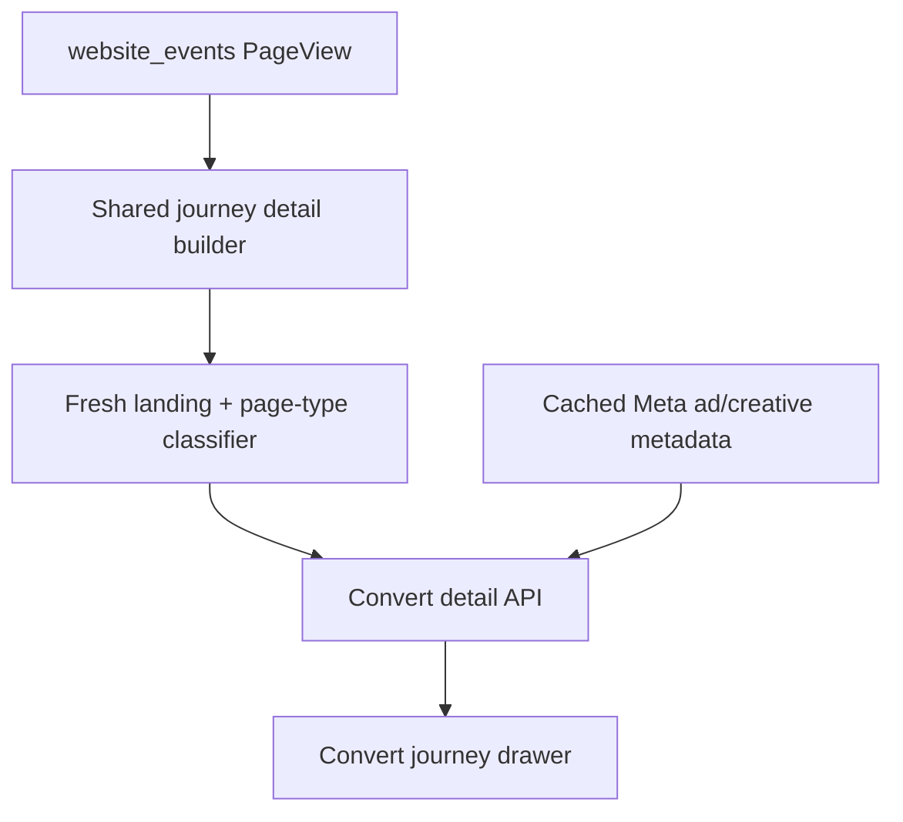

# Clarify Convert Journey Timeline Source Labels

## Summary

Convert's customer journey drawer should tell the real acquisition story in one cohesive timeline. This plan keeps raw website events as `PageView`, but changes drawer interpretation so paid Meta ad landings, Instagram profile landings, Facebook page landings, useful page views, booking steps, confirmed bookings, and CAPI events read like a human customer path instead of generic page receipts.

---

## Problem Frame

The current drawer has the right raw ingredients, but too many important journey moments render as `Page viewed`. A customer may click multiple ads on different days and those website landings can already be present in the event stream, yet the drawer does not make them obvious or attach ad/creative names at the timeline-event level.

---

## Requirements

- R1. Preserve raw database event names, especially `website_events.event_name = PageView`; this work changes display interpretation, not tracking semantics.
- R2. Label any fresh paid Meta landing on any website page as `Meta ad landing page viewed`, not only booking-page landings and not only the selected booking-session entry.
- R3. Distinguish fresh organic social landings as `Instagram profile link landing viewed` or `Facebook page link landing viewed` when the source can be determined, with a generic organic-social fallback only when necessary.
- R4. Keep the drawer as one curated full journey timeline: source-entry landings, useful page views by page type, booking steps, confirmed booking, and CAPI; continue suppressing low-signal noise such as scroll-depth and engaged-timer events by default.
- R5. Replace confusing return-event language in Convert UI with `Booking session started from...` copy while keeping legacy shared-detail compatibility during the transition.
- R6. Show ad name and creative name on timeline ad landing rows when the row has an ad ID and cached Meta catalog metadata exists.
- R7. Keep cached metadata read-only and avoid live Meta API calls, database migrations, Sales/ERP reads, or website tracker changes in this plan.
- R8. Add focused automated coverage for fresh landing classification, inherited-attribution false positives, page-type labels, booking-session summary copy, and timeline creative enrichment.

---

## Scope Boundaries

- No raw website event rename or schema migration.
- No website tracker changes unless implementation discovers the current persisted event payload cannot support the planned display behavior.
- No cross-visitor email/phone merge. Customer history remains scoped to the currently fetched visitor ID for this plan.
- No live Meta API calls from the drawer or detail API.
- No raw full-event debug stream by default.
- No Sales/ERP appointment, payment, invoice, budget, or owner data.
- No retirement of the legacy attribution page or legacy detail fields.

### Deferred to Follow-Up Work

- Cross-device / multiple-visitor customer merge by email or phone.
- Timeline grouping or collapse controls if real journeys become too long after clearer source labels ship.
- More granular social labels beyond Instagram profile and Facebook page if real data shows other common social sources.

---

## Context & Research

### Relevant Code and Patterns

- `src/lib/customer-journey-ledger.ts` owns the shared drawer detail model, timeline assembly, paid touch selection, and current `returnEvent` / `returnTouch` naming.
- `buildDetailTimeline()` currently includes booking-session events plus paid Meta landing events from other sessions, but `timelineLabel()` only returns `Meta ad landing page viewed` when the event is the selected return event.
- `isPaidMetaLandingEvent()` currently merges URL UTM, stored UTM columns, source type, and referrer. Because the website tracker can inherit prior attribution into later events, the new fresh-landing label should be stricter and prioritize current `page_url` query parameters plus current referrer.
- `src/components/v2/convert/customer-journey-drawer.tsx` renders the drawer summary, `Return touch` card, and timeline item ID fields.
- `src/app/api/convert/customer-ledger/detail/route.ts` is the Convert-owned detail endpoint and already calls `fetchCustomerJourneyLedgerDetail()`.
- `src/lib/customer-ledger-creative-enrichment.ts` already performs cached `meta_ads -> meta_creatives` enrichment for table rows and should be extended or factored so timeline events can reuse the same metadata source.
- `tests/attribution-ledger.test.ts` already covers curated timeline behavior, paid touch selection, link-in-bio / social return cases, and URL-derived ad IDs.
- `tests/customer-ledger-creative-enrichment.test.ts` already covers cached creative metadata fallback behavior.

### Institutional Learnings

- `docs/data-boundaries.md` keeps Ads Analyst reads separate from Sales/ERP Core. This plan stays inside Ads Analyst-owned website attribution tables and Meta catalog tables.
- `docs/sync-architecture.md` establishes cached creative media as the durable display source and warns that Meta CDN URLs can expire.
- The related Convert drawer plan explicitly avoided a raw all-events debug stream by default; this plan keeps that decision and improves the curated timeline instead.

### External References

- None. Local patterns cover the relevant drawer data flow, cached creative enrichment, route permissions, and test style.

---

## Key Technical Decisions

- Use display labels, not new raw event names. `PageView` remains the tracking event; the drawer interprets it based on current source signals and page type.
- Treat "fresh paid Meta landing" as a stricter concept than "row has paid-looking attribution." Use current `page_url` query and current referrer first so old inherited attribution does not turn later direct visits into fake ad landings.
- Keep a single cohesive curated timeline. Separate ad history would make scanning split-brain; the drawer should instead make ad landings obvious inside the same chronological path.
- Replace Convert-facing `Return touch` language with `Booking session started from` while preserving `returnTouch` as a compatibility alias in the shared detail response until legacy consumers are migrated.
- Enrich timeline events at the Convert detail API boundary rather than making the base shared journey model always read Meta catalog tables. This keeps the shared attribution read model focused and lets Convert own presentation enrichment.
- Prefer cached creative media and stored names from `meta_ads` / `meta_creatives`; no page-render live Meta calls.

---

## Open Questions

### Resolved During Planning

- Should timeline show raw full event stream? No. Use the curated full journey: source-entry landings, useful page views, booking steps, conversion, and CAPI.
- Should `Meta ad landing page viewed` apply only to booking page? No. It applies to any landing page from paid Meta.
- Should Instagram profile link and Facebook page link be distinct? Yes.
- Should ad name and creative name show in timeline? Yes.
- Should cross-visitor email/phone merge happen now? No. It is explicitly later.

### Deferred to Implementation

- Exact helper names for the fresh source classifier. The plan requires the behavior and tests, not a specific function name.
- Exact social fallback label for ambiguous social traffic. Use a generic organic-social label only if Instagram/Facebook profile source cannot be determined.
- Exact event grouping threshold. Do not add grouping in this plan unless the implementation makes the drawer unusably noisy in the verified scenarios.

---

## High-Level Technical Design

> *This illustrates the intended approach and is directional guidance for review, not implementation specification. The implementing agent should treat it as context, not code to reproduce.*

| Timeline input | Fresh signal source | Display label |
|---|---|---|
| `PageView` with current URL `fbclid`, Meta ad IDs, or URL paid Meta UTM | Current `page_url` query first; current referrer as support | `Meta ad landing page viewed` |
| `PageView` from Instagram profile without paid signal | Current referrer/source from Instagram | `Instagram profile link landing viewed` |
| `PageView` from Facebook page without paid signal | Current referrer/source from Facebook | `Facebook page link landing viewed` |
| `PageView` on booking path without source-entry signal | Page path/group | `Booking page viewed` |
| `PageView` on product path without source-entry signal | Page path/group | `Product page viewed` |
| `PageView` on custom jewelry path without source-entry signal | Page path/group | `Custom jewelry page viewed` |
| Other useful `PageView` | Page path/group fallback | `Page viewed` |
| Booking actions | Existing event names | Existing booking-step labels |
| Conversion/CAPI | Existing conversion rows | Existing conversion/CAPI labels |

---

## Implementation Units

### U1. Characterize Fresh Landing and Page-Type Label Rules

**Goal:** Lock down the intended timeline display behavior before changing label logic.

**Requirements:** R1, R2, R3, R4, R8

**Dependencies:** None

**Files:**
- Modify: `tests/attribution-ledger.test.ts`
- Test: `tests/attribution-ledger.test.ts`

**Approach:**
- Add focused timeline cases around multiple pre-booking ad landings, organic Instagram/Facebook profile landings, normal booking/product/custom page views, and inherited attribution.
- Model the real tracking caveat: a later event may carry stored paid UTM columns, but if the current `page_url` lacks fresh paid signal and referrer/source is direct, it must not render as a Meta ad landing.
- Keep existing tests that prove post-booking noise remains excluded.

**Execution note:** Start with characterization tests so later refactor mistakes produce clear failures.

**Patterns to follow:**
- Existing timeline tests in `tests/attribution-ledger.test.ts`.
- Existing helper row factories in the same test file.

**Test scenarios:**
- Happy path: two `PageView` events with different current `utm_ad_id` values before one booking both appear as `Meta ad landing page viewed`.
- Happy path: a paid Meta landing on a product page still appears as `Meta ad landing page viewed`, not `Product page viewed`.
- Happy path: an Instagram referrer without paid/ad IDs appears as `Instagram profile link landing viewed`.
- Happy path: a Facebook referrer without paid/ad IDs appears as `Facebook page link landing viewed`.
- Edge case: direct booking page view with inherited stored paid UTM columns but no fresh URL/referrer paid signal appears as `Booking page viewed`, not `Meta ad landing page viewed`.
- Edge case: product and custom jewelry page views without source-entry signal render as `Product page viewed` and `Custom jewelry page viewed`.

**Verification:**
- Timeline label tests fail against the current generic-label behavior and pass only when fresh landing and page-type rules are implemented.

### U2. Implement Curated Timeline Source Classification

**Goal:** Update shared timeline assembly so source-entry and page-type labels are accurate for the curated full journey.

**Requirements:** R1, R2, R3, R4, R8

**Dependencies:** U1

**Files:**
- Modify: `src/lib/customer-journey-ledger.ts`
- Modify: `tests/attribution-ledger.test.ts`
- Test: `tests/attribution-ledger.test.ts`

**Approach:**
- Split "fresh landing classification" from generic paid-touch detection.
- For labels, prefer current `page_url` query parameters over stored event UTM columns to avoid inherited-attribution false positives.
- Keep stored event UTM/ad IDs available for technical fields, paid-touch attribution, and existing funnel/ledger behavior; only the human display label becomes stricter.
- Update `timelineLabel()` or its replacement so all paid Meta landing page events, including earlier cross-session landings already included by `buildDetailTimeline()`, render as `Meta ad landing page viewed`.
- Add page-type labels for booking, product, custom jewelry, and safe fallback page views.
- Preserve curated filtering: same booking-session events plus prior paid Meta landings; do not add scroll-depth or engaged-timer events by default.

**Patterns to follow:**
- Current `buildDetailTimeline()` inclusion rules in `src/lib/customer-journey-ledger.ts`.
- Current `pageGroupFromUrl()` / booking-stage helpers in the same module.
- Existing `utmFromUrl()` / `normalizedUtmRecord()` helpers.

**Test scenarios:**
- Happy path: earlier-session paid Meta landing is included and labeled as `Meta ad landing page viewed`.
- Happy path: booking-session organic Instagram entry is labeled distinctly from paid Meta.
- Edge case: source labels do not change conversion, booking, or CAPI event labels.
- Edge case: post-booking page events beyond the detail window remain excluded.
- Edge case: inherited paid attribution does not override a fresh direct page-view label.

**Verification:**
- Shared detail timeline output reads as one chronological curated journey with accurate source-entry labels.

### U3. Rename Convert-Facing Booking Session Source Copy

**Goal:** Remove confusing "return touch" wording from Convert while preserving shared API compatibility.

**Requirements:** R5, R8

**Dependencies:** U2

**Files:**
- Modify: `src/lib/customer-journey-ledger.ts`
- Modify: `src/components/v2/convert/customer-journey-drawer.tsx`
- Modify: `tests/attribution-ledger.test.ts`
- Test: `tests/attribution-ledger.test.ts`

**Approach:**
- Add booking-session source semantics to the shared detail payload in a backward-compatible way. Keep `returnTouch` available for legacy attribution-page consumers, but introduce new Convert-facing names or adapter fields such as booking-session entry source.
- Update summary language from `returned from...` to `Booking session started from...`.
- Change the drawer card title from `Return touch` to `Booking session started from`.
- Keep the selected booking-session entry limited to the booking session before conversion; this is a session summary, not a list of all ad landings.
- Ensure the summary uses clear source labels:
  - `Booking session started from Meta ad DM_IG_HeyBeyArea; booked 18m later.`
  - `Booking session started from Instagram profile link; booked 6m later.`
  - `Booking session started from direct website visit; booked 4m later.`

**Patterns to follow:**
- Existing `summarizePath()` in `src/lib/customer-journey-ledger.ts`.
- Existing touch summary card rendering in `src/components/v2/convert/customer-journey-drawer.tsx`.

**Test scenarios:**
- Happy path: paid booking-session entry summary uses `Booking session started from Meta ad...`.
- Happy path: Instagram organic booking-session entry summary uses `Booking session started from Instagram profile link...`.
- Edge case: no entry source falls back to a direct website visit or neutral booking conversion summary without implying ad credit.
- Compatibility: legacy `returnTouch` remains populated while new Convert-facing source field is introduced.

**Verification:**
- Convert drawer no longer exposes `Return touch` wording, and existing legacy consumers remain unbroken.

### U4. Enrich Timeline Ad Events with Stored Ad and Creative Names

**Goal:** Attach human-readable ad and creative names to timeline rows that have ad IDs.

**Requirements:** R6, R7, R8

**Dependencies:** U2

**Files:**
- Modify: `src/lib/customer-ledger-creative-enrichment.ts`
- Modify: `src/app/api/convert/customer-ledger/detail/route.ts`
- Modify: `src/lib/customer-journey-ledger.ts`
- Modify: `tests/customer-ledger-creative-enrichment.test.ts`
- Test: `tests/customer-ledger-creative-enrichment.test.ts`

**Approach:**
- Extend the cached creative enrichment layer so it can enrich arbitrary ad-ID-bearing timeline items, not only top-level ledger rows.
- Add optional timeline fields for `adName`, `creativeName`, and `creativeId` without requiring every event to carry them.
- Batch unique timeline `adId`s from the detail payload in the Convert detail API and enrich before returning JSON.
- Reuse existing `meta_ads -> meta_creatives` selection, cached media preference, duplicate-row handling, and failure-soft behavior.
- Do not make `fetchCustomerJourneyLedgerDetail()` always query Meta catalog metadata; keep presentation enrichment at the Convert API boundary.

**Patterns to follow:**
- `enrichCustomerLedgerRowsWithCreativePreviews()` in `src/lib/customer-ledger-creative-enrichment.ts`.
- `resolveCreativeDisplayMedia()` and `creative-metadata-selection.ts`.
- Current Convert detail route in `src/app/api/convert/customer-ledger/detail/route.ts`.

**Test scenarios:**
- Happy path: timeline event with `adId` receives ad name, creative ID, and creative name from cached metadata.
- Edge case: multiple timeline events with different ad IDs are enriched in one batched lookup.
- Edge case: missing creative metadata leaves IDs intact and names null.
- Error path: metadata query failure returns original detail payload without failing the drawer API.
- Integration: row-level creative preview enrichment still behaves as before after helper extraction.

**Verification:**
- Drawer detail response has names for timeline ad events when stored metadata exists and remains usable when metadata is missing.

### U5. Render Timeline Source and Creative Context Clearly

**Goal:** Make the drawer timeline easy to scan for ad click / landing history inside the full customer journey.

**Requirements:** R2, R3, R4, R5, R6

**Dependencies:** U2, U3, U4

**Files:**
- Modify: `src/components/v2/convert/customer-journey-drawer.tsx`
- Test: `tests/attribution-ledger.test.ts`
- Test: `tests/customer-ledger-creative-enrichment.test.ts`

**Approach:**
- Update timeline rows to show ad/creative names above or beside technical IDs when present.
- Keep technical IDs visible for debugging, but make names the primary readable context:
  - Ad name
  - Creative name
  - Campaign/ad set/ad IDs
  - Source / medium / content / placement
- Ensure `Meta ad landing page viewed`, `Instagram profile link landing viewed`, and `Facebook page link landing viewed` rows are visually scannable without opening raw URLs.
- Keep ordinary page views useful by showing `Booking page viewed`, `Product page viewed`, `Custom jewelry page viewed`, or fallback `Page viewed`.
- Do not introduce nested cards inside the drawer timeline; keep the existing compact chronological layout.

**Patterns to follow:**
- Existing timeline item layout in `src/components/v2/convert/customer-journey-drawer.tsx`.
- Existing `CreativePreviewPanel` hierarchy and technical ID formatting in the same component.

**Test scenarios:**
- Test expectation: no component unit harness currently exists for this drawer. Verify rendering through TypeScript, focused data tests, and browser smoke.

**Verification:**
- Browser check: a drawer with paid ad events shows clear source labels and ad/creative names without text overlap.
- Browser check: a journey with organic Instagram/Facebook entry labels is understandable without reading raw URLs.
- Browser check: ordinary page views remain compact and do not drown out booking steps.

---

## System-Wide Impact

- **Interaction graph:** Website tracking remains unchanged; shared journey detail logic classifies labels; Convert detail API enriches names; Convert drawer renders the result.
- **Error propagation:** Creative metadata failures should warn and degrade to IDs-only timeline rows, not fail the drawer.
- **State lifecycle risks:** Inherited attribution can produce misleading stored UTM columns. Fresh landing labels must use current page URL/referrer first.
- **API surface parity:** The Convert detail API may return extra optional timeline fields. Existing legacy `returnTouch` consumers should remain compatible.
- **Integration coverage:** Tests should cover shared model output and metadata enrichment; browser verification should cover final drawer readability.
- **Unchanged invariants:** 30-day paid Meta booking credit, paid-touch attribution selection, raw event tracking, and funnel mappings remain unchanged.

---

## Risks & Dependencies

| Risk | Mitigation |
|------|------------|
| Inherited paid attribution causes false `Meta ad landing page viewed` labels | Use current `page_url` query/referrer for fresh source labeling and add regression tests. |
| Timeline becomes noisy | Keep curated full journey scope and suppress low-signal engagement events by default. Defer grouping until real journeys prove it is needed. |
| Creative metadata is missing or stale | Keep IDs visible and fail soft when metadata queries fail. Use cached Supabase creative media/names only. |
| Renaming `returnTouch` breaks legacy attribution UI | Add new Convert-facing naming while preserving `returnTouch` during transition. |
| Label logic changes attribution counts accidentally | Keep label helpers separate from paid attribution selection and funnel counting; test labels separately from credit logic. |

---

## Documentation / Operational Notes

- No database migration or operational rollout required.
- Deployment should include a quick authenticated `/convert` drawer smoke test after release.
- If support/debug docs mention `Return touch`, update wording to `Booking session started from` after implementation.

---

## Sources & References

- Related plan: [docs/plans/2026-05-21-001-refactor-customer-journey-ledger-plan.md](docs/plans/2026-05-21-001-refactor-customer-journey-ledger-plan.md)
- Related plan: [docs/plans/2026-05-21-002-feat-convert-journey-drawer-thumbnails-plan.md](docs/plans/2026-05-21-002-feat-convert-journey-drawer-thumbnails-plan.md)
- Shared detail model: [src/lib/customer-journey-ledger.ts](src/lib/customer-journey-ledger.ts)
- Convert drawer: [src/components/v2/convert/customer-journey-drawer.tsx](src/components/v2/convert/customer-journey-drawer.tsx)
- Convert detail API: [src/app/api/convert/customer-ledger/detail/route.ts](src/app/api/convert/customer-ledger/detail/route.ts)
- Creative enrichment: [src/lib/customer-ledger-creative-enrichment.ts](src/lib/customer-ledger-creative-enrichment.ts)
- Timeline tests: [tests/attribution-ledger.test.ts](tests/attribution-ledger.test.ts)
- Creative enrichment tests: [tests/customer-ledger-creative-enrichment.test.ts](tests/customer-ledger-creative-enrichment.test.ts)
